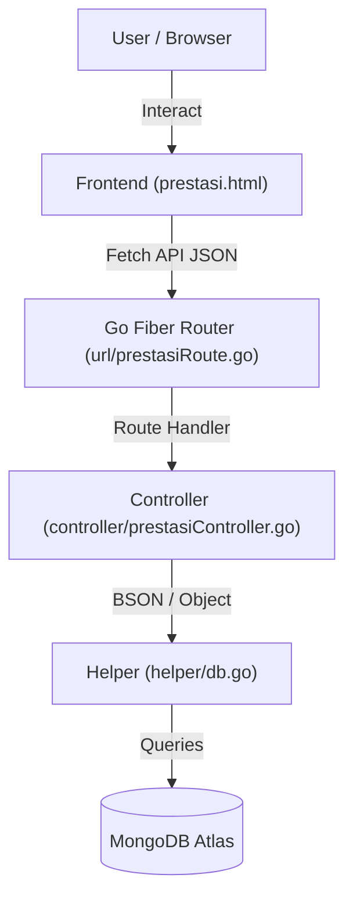

# Modul 10: Prestasi & Kategori — Portal Informasi Akademik Kampus (SIAKAD)

**Nama:** Mohammad Isa Widianto  
**NPM:** 714240013  
**Mata Kuliah:** Pemrograman Web Service  
**Modul:** 10 — Prestasi & Kategori  

---

## 1. Deskripsi Modul

**Modul 10: Prestasi & Kategori** adalah sub-sistem dari aplikasi Portal Informasi Akademik Kampus (SIAKAD) yang berfokus pada pencatatan, pengelolaan, dan klasifikasi prestasi akademik dan non-akademik mahasiswa. Modul ini diimplementasikan dengan arsitektur REST API menggunakan **Go Fiber** untuk backend, **MongoDB** sebagai database, dan antarmuka web modern dengan konsep **Glassmorphism & Neon-theme Dark Mode** di sisi frontend.

---

## 2. Tujuan Modul

- **Pencatatan Portofolio Mahasiswa**: Menyediakan wadah terstruktur bagi kampus untuk mendata pencapaian prestasi mahasiswa (tingkat lokal, regional, nasional, hingga internasional).
- **Klasifikasi Dinamis**: Mempermudah pengelompokan prestasi menggunakan entitas kategori prestasi yang dinamis (seperti Akademik, Seni, Olahraga, Keagamaan, dsb).
- **Efisiensi Pencarian**: Menyediakan fitur filter data berdasarkan kategori serta pencarian instan menggunakan NPM mahasiswa.
- **Peningkatan User Experience**: Menyajikan dashboard interaktif dengan micro-animations dan umpan balik toast notifikasi yang informatif.

---

## 3. Tech Stack

| Layer | Teknologi | Deskripsi |
|---|---|---|
| **Backend** | Go + Go Fiber v2 | Framework web performa tinggi untuk membangun REST API |
| **Database** | MongoDB Atlas | Database NoSQL berorientasi dokumen untuk fleksibilitas skema data |
| **Frontend** | HTML5 + CSS3 (Vanilla) + Javascript (Vanilla) | Desain premium modern, responsive, dan tanpa framework tambahan |
| **Hosting** | Alwaysdata | Platform hosting untuk server Go |
| **CI/CD** | GitHub Actions | Otomatisasi proses build, transfer binary, dan restart server |

---

## 4. Struktur Data (Model)

Modul ini menggunakan dua struct utama di backend untuk menyimpan data ke database MongoDB:

### 4.1. Prestasi
Menyimpan detail prestasi mahasiswa, termasuk relasi kategori dalam bentuk string nama kategori.
- **File**: [model/prestasi.go](file:///c:/Users/Saha%27s/Documents/1tugaskampus/Pemrog3/714240013/model/prestasi.go)

```go
type Prestasi struct {
	ID        primitive.ObjectID `bson:"_id,omitempty" json:"id,omitempty"`
	NPM       string             `bson:"npm" json:"npm"`
	NamaEvent string             `bson:"nama_event" json:"nama_event"`
	Tingkat   string             `bson:"tingkat" json:"tingkat"` // e.g. Lokal, Regional, Nasional, Internasional
	Juara     string             `bson:"juara" json:"juara"`     // e.g. Juara 1, Harapan 1, dll
	Tanggal   string             `bson:"tanggal" json:"tanggal"` // format: YYYY-MM-DD
	Kategori  string             `bson:"kategori" json:"kategori"` // nama kategori relasi
}
```

### 4.2. Kategori Prestasi
Menyimpan daftar kategori prestasi yang tersedia di sistem.
- **File**: [model/prestasi.go](file:///c:/Users/Saha%27s/Documents/1tugaskampus/Pemrog3/714240013/model/prestasi.go)

```go
type KategoriPrestasi struct {
	ID   primitive.ObjectID `bson:"_id,omitempty" json:"id,omitempty"`
	Nama string             `bson:"nama" json:"nama"` // e.g. Akademik, Non-Akademik, Olahraga, Seni
}
```

---

## 5. Arsitektur Sistem Modul 10



---

## 6. Endpoints REST API (Modul 10)

Berikut adalah daftar endpoint API yang diimplementasikan pada file [url/prestasiRoute.go](file:///c:/Users/Saha%27s/Documents/1tugaskampus/Pemrog3/714240013/url/prestasiRoute.go):

### 6.1. Entitas Prestasi

| Method | Endpoint | Fungsi | Payload (JSON) |
|---|---|---|---|
| `GET` | `/prestasi` | Mengambil seluruh data prestasi mahasiswa | - |
| `GET` | `/prestasi/:npm` | Mengambil data prestasi milik mahasiswa berdasarkan NPM | - |
| `POST` | `/prestasi` | Menambahkan data prestasi baru | `{"npm": "...", "nama_event": "...", "tingkat": "...", "juara": "...", "tanggal": "YYYY-MM-DD", "kategori": "..."}` |
| `PUT` | `/prestasi/:id` | Mengupdate data prestasi berdasarkan ID objek | `{"npm": "...", "nama_event": "...", "tingkat": "...", "juara": "...", "tanggal": "YYYY-MM-DD", "kategori": "..."}` |
| `DELETE` | `/prestasi/:id` | Menghapus data prestasi berdasarkan ID objek | - |

### 6.2. Entitas Kategori Prestasi

| Method | Endpoint | Fungsi | Payload (JSON) |
|---|---|---|---|
| `GET` | `/kategori-prestasi` | Mengambil seluruh kategori prestasi yang terdaftar | - |
| `POST` | `/kategori-prestasi` | Menambahkan kategori prestasi baru ke sistem | `{"nama": "..."}` |
| `GET` | `/prestasi/kategori/:nama` | Menyaring data prestasi berdasarkan nama kategori | - |

---

## 7. Desain Frontend (UI/UX)

Antarmuka pengguna terletak pada file [frontend/prestasi/prestasi.html](file:///c:/Users/Saha%27s/Documents/1tugaskampus/Pemrog3/714240013/frontend/prestasi/prestasi.html). Halaman ini dirancang dengan gaya modern premium yang menawarkan:
1. **Glassmorphic Cards**: Elemen antarmuka transparan dengan efek blur latar belakang (`backdrop-filter`) di atas gradasi warna ungu dan biru gelap.
2. **Dual Action Form**:
   - **Form Input Prestasi**: Input NPM, Nama Event, Tingkat, Juara, Tanggal, dan dropdown Kategori.
   - **Form Manajemen Kategori**: Input kategori prestasi baru yang langsung tersinkronisasi ke dropdown input prestasi & filter.
3. **Interactive Table**: List prestasi lengkap dengan badge tingkat, kategori, dan juara, dilengkapi tombol aksi edit (modal pop-up) dan hapus.
4. **Dynamic Filters**:
   - Dropdown filter instan untuk menyaring data berdasarkan Kategori (memanfaatkan API `/prestasi/kategori/:nama`).
   - Fitur cari berdasarkan NPM (memanfaatkan API `/prestasi/:npm`).
5. **Toast Notifications**: Notifikasi pop-up dinamis di pojok kanan bawah untuk memberi umpan balik instan saat aksi Simpan, Edit, Hapus, atau Gagal berhasil diproses.

---

## 8. Struktur Folder Repositori

Berikut adalah letak file yang berkaitan langsung dengan implementasi Modul 10:

```
714240013/
├── config/                      
├── helper/                      
├── model/
│   ├── model.go                 
│   └── prestasi.go              <-- [Modul 10] Struct Prestasi & KategoriPrestasi
├── controller/
│   ├── controller.go            
│   └── prestasiController.go    <-- [Modul 10] Handler Logika Database (CRUD & Filter)
├── url/
│   ├── url.go                   <-- Registrasi route PrestasiRoute(app)
│   └── prestasiRoute.go         <-- [Modul 10] Definisi Endpoint & Mapping Controller
├── frontend/
│   ├── index.html               
│   └── prestasi/
│       └── prestasi.html        <-- [Modul 10] Halaman Dashboard Prestasi & Kategori (UI/UX)
├── main.go                      
├── go.mod                       
└── .env                         <-- Environment variables (local database connection)
```

---

## 9. Cara Menjalankan Aplikasi Secara Lokal

### 9.1. Prasyarat
- Pastikan telah menginstal **Go** versi terbaru.
- Pastikan server MongoDB Atlas aktif dan connection string telah disiapkan.

### 9.2. Langkah Instalasi

1. Clone repositori ke komputer lokal Anda:
   ```bash
   git clone https://github.com/24A-TI-ULBI/714240013.git
   cd 714240013
   ```

2. Buat file `.env` di direktori root proyek dan masukkan konfigurasi koneksi database:
   ```env
   MONGOSTRING=mongodb+srv://<username>:<password>@<cluster>.mongodb.net/?retryWrites=true&w=majority
   MONGODB_NAME=siakad
   PORT=8080
   ```

3. Jalankan perintah `go mod tidy` untuk mengunduh seluruh dependensi proyek:
   ```bash
   go mod tidy
   ```

4. Jalankan aplikasi web:
   ```bash
   go run main.go
   ```

5. Buka peramban (browser) dan akses alamat berikut:
   - Aplikasi Backend / API: `http://localhost:8080`
   - Frontend Prestasi: `http://localhost:8080/frontend/prestasi/prestasi.html`

---

## 10. Alur Integrasi CI/CD & Deploy

Aplikasi ini menggunakan **GitHub Actions** untuk alur deployment otomatis ke platform **Alwaysdata**. Setiap kali perubahan di-merge ke branch utama:
1. GitHub Actions akan mendeteksi perubahan dan menjalankan pipeline build.
2. Kode Go dikompilasi menjadi berkas biner (executable).
3. Berkas biner dikirim ke server Alwaysdata via protokol SCP.
4. Server Alwaysdata direstart melalui REST API Alwaysdata untuk menerapkan perubahan kode terbaru secara real-time.

---

## 11. Referensi

- [Dokumentasi Go Fiber](https://gofiber.io/)
- [MongoDB Go Driver](https://mongodb.com/docs/drivers/go/current/)
- [Glassmorphic UI Design Principles](https://css-tricks.com/glassmorphism-creative-companion-css-grid/)
- [Alwaysdata Cloud Service](https://www.alwaysdata.com)
